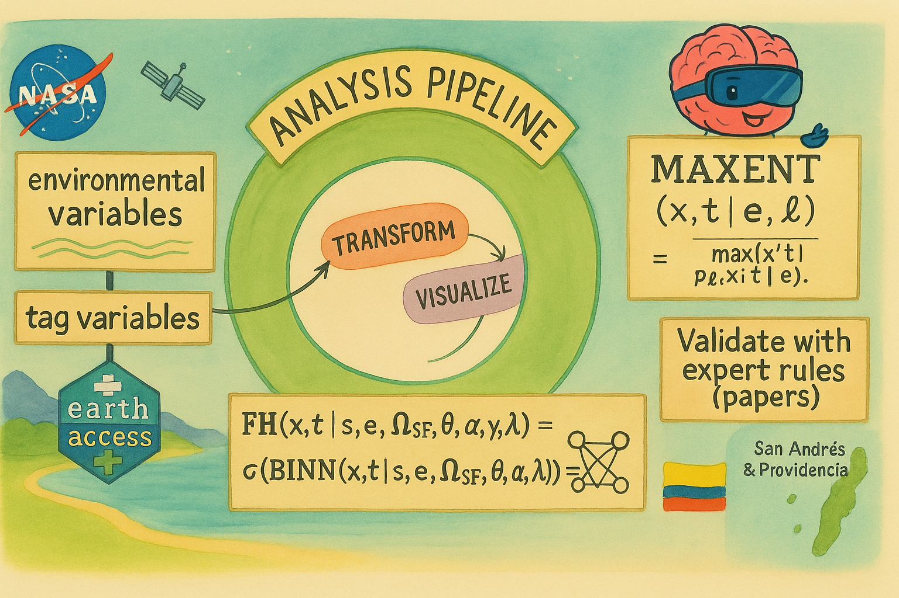

# Sharks from Space – Chiwinners (Data + Model Repo)



This repository contains the end-to-end data and modeling stack for the **NASA Space Apps Challenge 2025 – Sharks from Space** (Team: **Chiwinners**).  
It includes: dataset mocks with a final target schema, download & transform pipelines, a hybrid **MaxEnt + BINN** modeling module, lightweight simulation tools, and loaders to publish artifacts for the web app.

---

## 1) Mathematical Modeling

### 1.1 Problem framing
We aim to estimate **habitat suitability** and **foraging probability** for sharks by combining **presence-only environmental modeling** (MaxEnt) with a **Bayesian Inference Neural Network (BINN)** that fuses environmental covariates, tag-derived features, and explicit spatial priors. Presence points come from **blue shark** tag locations; we denote the presence label as **`SHARKS`**.

### 1.2 Environmental covariates (x, t)
We consider the following environmental variables sampled on a spatiotemporal grid:

| Variable | Meaning (unit) | Role |
|---|---|---|
| **SST** | Sea Surface Temperature (°C) | thermal habitat |
| **dSST (DSST)** | Horizontal temperature gradient magnitude (°C/km) | frontal/edge dynamics |
| **DEPTH** | Seafloor depth / bathymetry (m, positive down) | geomorphic constraint |
| **EKE** | Eddy Kinetic Energy (m²/s²) | mesoscale turbulence |
| **LIGHT** | Light availability / PAR proxy (mol photons m⁻² d⁻¹ or W m⁻²) | photic effects |
| **CHL** | Chlorophyll-a (mg m⁻³) | productivity proxy |

Let \( \mathbf{x}(s,t) = [\mathrm{SST}, \mathrm{dSST}, \mathrm{DEPTH}, \mathrm{EKE}, \mathrm{LIGHT}, \mathrm{CHL}] \) at location \(s\) and time \(t\). Presence points \( \{s_i,t_i\} \) from **SHARKS** define the observed occurrences.  
We also extract **tag-derived features** \( \mathbf{z}_{	ext{tag}} \) (e.g., vertical activity, depth dynamics, acceleration summaries) when available.

### 1.3 MaxEnt (presence-only suitability)
MaxEnt estimates a distribution over space–time that is maximally entropic subject to feature expectation constraints. In the logistic approximation for presence–background modeling, the **habitat suitability** (or relative occurrence intensity) can be written as:
\[
S(s,t) \;=\; \sigma\!\Big( \beta_0 \;+\; \sum_{j} \beta_j \, f_j\!\big(\mathbf{x}(s,t)\big) \Big)
\]
where \(f_j\) are (possibly transformed) covariates (linear, spline, thresholds) and \(\sigma(z)=1/(1+e^{-z})\). Coefficients \(\{\beta_j\}\) are fit to match empirical expectations under presence vs. background.  
**Interpretation.** \(S(s,t)\in(0,1)\) is a **suitability surface**: higher values indicate environmental conditions more consistent with observed presences.

### 1.4 BINN (Bayesian Inference Neural Network) for foraging
We further predict **foraging behavior** with a BINN that integrates:
- **Environmental covariates** \( \mathbf{x}(s,t) \)
- **Tag-derived variables** \( \mathbf{z}_{\text{tag}}(s,t) \)
- **MaxEnt suitability** \( S(s,t) \) as an **informative prior**
- A **spatial regularizer** tied to the **Seaflower** MPA (Colombian Caribbean)

Let \( \mathbf{z}(s,t) = [\mathbf{x}(s,t), \mathbf{z}_{\text{tag}}(s,t)] \). The BINN outputs a **foraging probability**:
\[
P\big(\mathrm{FH}=1 \mid \mathbf{z}(s,t)\big) \;=\; \sigma\!\Big( g_{\theta}\big(\mathbf{z}(s,t)\big) \;+\; \alpha \cdot \mathrm{logit}\big(S(s,t)\big) \;+\; \lambda \cdot R_{\mathrm{SF}}(s) \Big)
\]
where \(g_{\theta}(\cdot)\) is a neural network (likelihood term), \(\mathrm{logit}(S)=\ln\frac{S}{1-S}\) injects **MaxEnt** as a **prior** (weight \(\alpha\)), and \(R_{\mathrm{SF}}(s)\) is a Seaflower-based spatial regularizer (e.g., mask or distance-to-boundary), weighted by \(\lambda\).

**Why BINN?** BINNs allow us to (i) retain a **principled prior** from presence-only ecology (MaxEnt), (ii) **fuse heterogeneous signals** (environment + tag dynamics), and (iii) **encode spatial knowledge** (MPA constraints) as a soft regularizer—improving robustness and ecological plausibility of foraging predictions.

**Outputs.**
- \(S(s,t)\): habitat suitability.
- \(P(\mathrm{FH}=1\mid \cdot)\): foraging probability surface.  
Both can be exported as rasters, tiles, or vector **GeoJSON** (contours/isolines or polygons after post-processing).

### 1.5 Seaflower (ecological context)
**Seaflower** is a large, biodiversity-rich marine region in the Colombian Caribbean, with coral reefs, seagrass meadows, and key habitats for pelagic species. We use a Seaflower polygon/mask to softly regularize predictions, aligning the model with known conservation areas and expected ecological patterns.

---

## 2) Data Flow / Pipeline

```mermaid
flowchart LR
  A[Downloads (OB.DAAC / AVISO / other)
extract/] --> B[Raw samples per source
 downloads/<var>/sample/*]
  B --> C[Inspect & QC
 transform/<var>/inspect.ipynb]
  C --> D[Partitioned Parquet
 transform/<var>/sample/year=/month=]
  D --> E[Unification (OBT)
 utils/unify_datasets.py -> data/ schema]
  E --> F1[MaxEnt training
 model/train_maxent.py]
  F1 --> G1[Suitability S(s,t)]
  E --> F2[BINN training
 model/train_binn.py]
  G1 --> F2
  F2 --> G2[Foraging probability
 P(FH=1|·)]
  G1 --> H[Prediction/Export
 model/predict.py -> GeoJSON]
  G2 --> H
  H --> I[Publish to Azure
 load/load.py -> web app]
```

**Key artifacts.**  
- **OBT** (One Big Table): analysis-ready join of tag + environmental covariates.  
- **GeoJSON exports**: region polygons (e.g., Seaflower), convex hulls, and predicted foraging zones.

---

## 3) How to run the project

### 3.1 Create and activate a virtual environment
```bash
# Windows (PowerShell)
python -m venv .venv
.venv\Scripts\Activate.ps1

# macOS / Linux
python3 -m venv .venv
source .venv/bin/activate
```

### 3.2 Install dependencies
```bash
pip install -r requirements.txt
```

### 3.3 Environment variables
Create a `.env` file (or set at runtime) with:
```
EARTHDATA_TOKEN=<your_earthdata_token>
AZURE_STORAGE_ACCOUNT_NAME=<your_account>
AZURE_STORAGE_KEY=<your_key>
```
- `EARTHDATA_TOKEN`: NASA Earthdata/OB.DAAC downloads.
- `AZURE_STORAGE_ACCOUNT_NAME`, `AZURE_STORAGE_KEY`: publish artifacts for the web app.

### 3.4 Typical commands (E2E)
```bash
# 1) Download samples (per source)
bash extract/bash/download_sst.sh
python extract/python/clorophyll.py
python extract/python/eke.py
python extract/python/depth.py

# 2) Inspect & transform to partitioned Parquet
#   (see transform/<var>/inspect.ipynb and transform/<var>/transform.ipynb)

# 3) Unify into OBT / analysis-ready tables
python utils/unify_datasets.py

# 4) Train models
python -m model.train_maxent --config model/config.py
python -m model.train_binn  --config model/config.py

# 5) Predict & export
python -m model.predict --region seaflower --out load/data/seaflower_zf_prediction.geojson

# 6) Publish to Azure
python load/load.py --file load/data/seaflower_zf_prediction.geojson --blob-key seaflower_zf_prediction.geojson
```

### 3.5 Clean repository tree for docs (optional)
Generate a tree that excludes heavy/ephemeral directories:
```bash
# Git Bash / MINGW64 / macOS / Linux
find .   -path "./downloads/*/data*" -prune -o   -path "./.venv*" -prune -o   -path "./.git*" -prune -o   -print | sed 's|[^/]*/| |g' | sed 's| | |g' > tree.txt
```
Embed `tree.txt` into docs as needed.

---

## 4) Modules overview

- **`data/`** – Mock datasets in the final, analysis-ready schema + **`data_dictionary.txt`**.
- **`downloads/`** – Source-specific folders with `sample/` files and `metadata.txt` (download notes, URLs if any).
- **`transform/`** – Notebooks/scripts to **inspect** raw samples and **normalize** to the final schema (partitioned by `year=/month=`).
- **`model/`**
  - `maxent.py` — habitat suitability (presence-only).
  - `binn.py` — BINN classifier for foraging (uses MaxEnt prior + spatial regularizer).
  - `features.py`, `data_io.py`, `sampling.py`, `utils.py` — feature engineering and IO.
  - `train_maxent.py`, `train_binn.py` — training entry points.
  - `predict.py` — batch/geo prediction utilities.
  - `config.py` — central configuration.
- **`extract/`** – Bash/Python downloaders (NASA/OB.DAAC and others).
- **`load/`** – Publish artifacts (e.g., GeoJSON) to **Azure Blob Storage**.
- **`simulation/`** – Mock sensor generator for end-to-end tests.
- **`docs/`** – Diagrams, images, documentation assets.
- **`utils/`** – Local helpers (inspection, sampling, unification, AOI checks).

---

## 5) Notes & acknowledgements
- Keep secrets in `.env`; do not commit credentials or large raw datasets.
- Large raw data live under `downloads/*/sample/` (and optionally `downloads/*/data`) and are excluded from doc trees.  
- NASA Earthdata / OB.DAAC; AVISO products where applicable.  
- Built for NASA Space Apps 2025 by **Team Chiwinners**.
